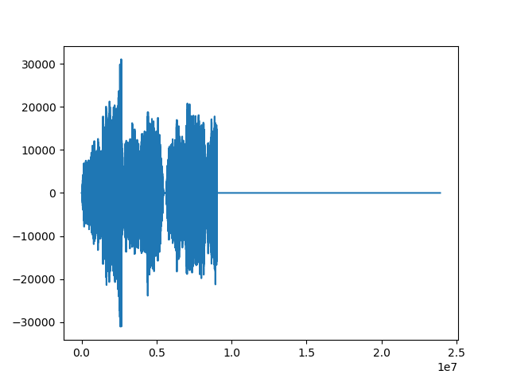
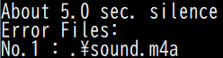
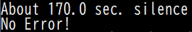

# Silence Checker m4a 
m4aファイルに指定秒数間の無音が存在するか調べる

## はじめに
CDからiTunesに音楽ファイルを取り込んだ際に，たまに1曲の全てが取り込めておらず，途中で無音になる現象を確認．そういったファイルを一括でチェックするために作成（もちろん全曲聴いて確認すればいい話だけど...）．  
対象ファイルはm4aファイルのみ．もちろんwavやmp3なども一部変更すれば可能．

## 使用例
例として「sound.m4a」に無音が存在するか調べる．実際，このファイルは以下に示すように最後約169秒間の静寂が存在する（もちろん曲の余韻などではなく，途中でぶつ切りされる）．  

  

コマンドラインで
```
> python silence_checker_m4a.py -d [m4aファイルが存在するディレクトリパス] -s [チェックする無音時間[sec.]]
```
を入力する．ただし，ディレクトリを指定しない場合はカレントを対象とし，無音時間を指定しない場合は既定で5秒間の無音を調べることになる．  
実際の実行結果が以下（無音時間は5秒）  

コマンドライン：  
```
> python silence_checker_m4a.py
```
出力1：  
  

sound.m4aは5秒以上の無音を含むので，無事にエラーファイルとして出力された．  
このファイルに対して，指定秒数を170などで実行すると，無音が検知されず，エラーファイルとして出力されない． 

出力2：  
  

楽曲によっては，前後の無音が長い曲もあるので，指定秒数によっては必ずしもエラーファイルとならない点に注意．